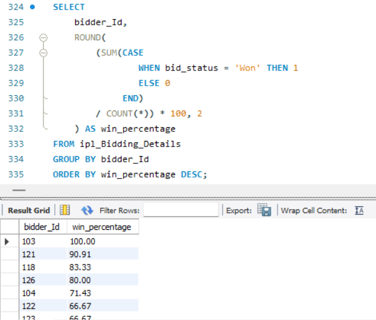
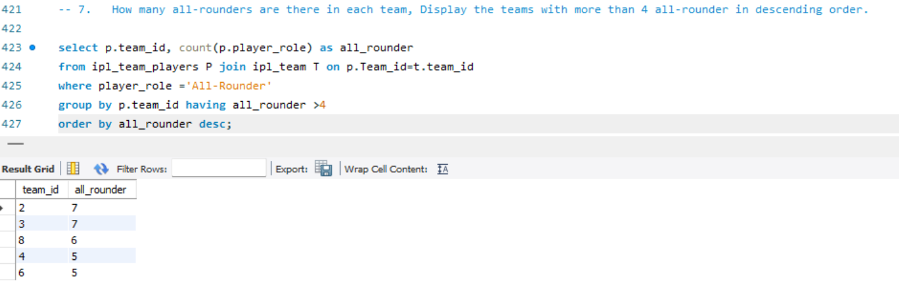

# 🏏 IPL Match Bidding System – MySQL Database Project

## 📌 Project Overview

This project is a **Database Management System (DBMS)** implementation of an IPL Match Bidding Application called **“Pie-in-the-Sky”**.

The system allows registered users to predict IPL match winners and earn points based on dynamic rules. The project is fully designed and implemented using **MySQL**, including:

- Database schema design
- Table creation with primary & foreign keys
- Relationships (ER model implementation)
- Data insertion
- Complex SQL queries for analytics and reporting

This project demonstrates strong understanding of:
- Relational Database Design
- Normalization
- Joins & Subqueries
- Aggregate Functions
- Grouping & Filtering
- Real-world business logic implementation in SQL

---

## 🛠️ Tech Stack

- **Database:** MySQL
- **Tools Used:** MySQL Workbench
- **Concepts Used:** ER Diagram, Primary Keys, Foreign Keys, Composite Keys, Constraints, Aggregations

---

## 🧩 Database Features

### 👤 User & Admin Management
- User registration (Bidder/Admin)
- Encrypted password storage
- Role-based access

### 🏟️ Tournament & Match Management
- Tournament creation
- Match scheduling & rescheduling
- Toss winner & match winner tracking
- Stadium management

### 💰 Dynamic Bidding System
- Users can bid before toss
- No negative marking
- Dynamic point system based on team standings
- Bid cancellation allowed before match starts

### 🏆 Leaderboard System
- Bidder ranking
- Top 3 leaders display
- Win percentage calculation

---

## 🗂️ Database Schema (Tables Created)

- IPL_User  
- IPL_Stadium  
- IPL_Team  
- IPL_Player  
- IPL_Team_Players  
- IPL_Tournament  
- IPL_Match  
- IPL_Match_Schedule  
- IPL_Bidder_Details  
- IPL_Bidding_Details  
- IPL_Bidder_Points  
- IPL_Team_Standings  

All tables are connected using proper **Primary Keys & Foreign Keys** to maintain referential integrity.

---

## 📊 SQL Queries Implemented

✔ Percentage of wins of each bidder (Highest to Lowest)  
✔ Number of matches conducted at each stadium  
✔ Toss winner win percentage in a stadium  
✔ Total bids with team name  
✔ Match winner identification using win details  
✔ Team performance (Played, Won, Lost)  
✔ Count of all-rounders per team (> 4 filter)  

These queries demonstrate:
- GROUP BY
- HAVING
- ORDER BY
- INNER JOIN
- Subqueries
- Aggregate Functions
- Conditional Logic

---

## 🖼️ ER Diagram

---

## 🖼️ Sample Query Outputs

  
  

---

## 🎯 Learning Outcomes

Through this project, I gained hands-on experience in:

- Designing a real-world relational database
- Writing optimized SQL queries
- Implementing business rules in SQL
- Handling composite keys
- Building a structured and scalable schema

---

## 📌 Future Improvements

- Add Stored Procedures
- Add Triggers for automatic point updates
- Connect database to a frontend application
- Optimize queries using indexes

---

## 👨‍💻 About Me

I am building strong skills in **Data Analytics and Database Management**.  
This project reflects my understanding of real-world database design and SQL problem solving.

If you liked this project, feel free to ⭐ star the repository!

---
